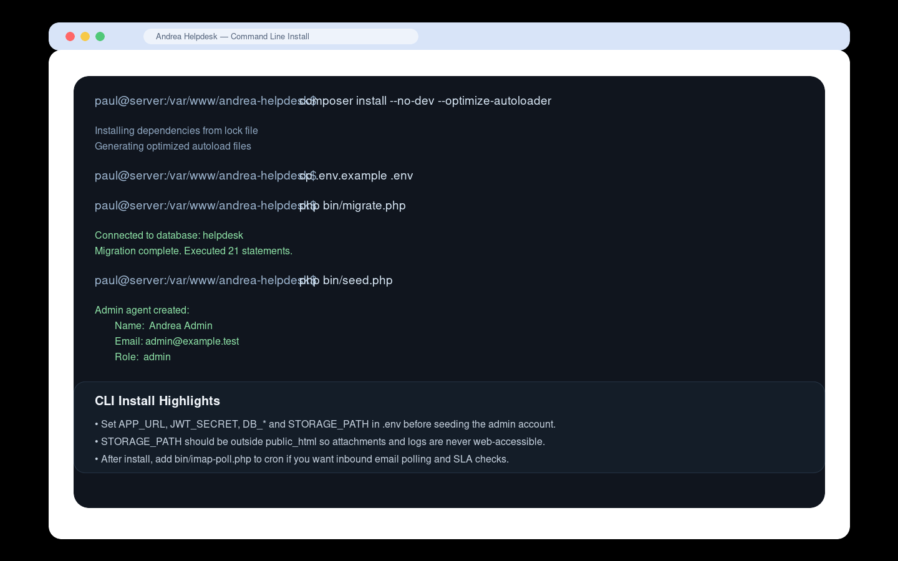
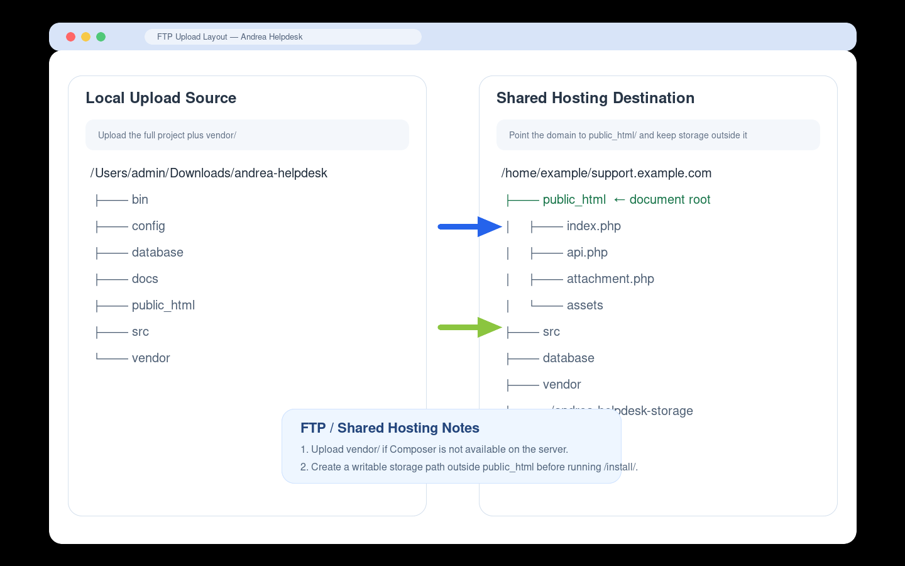
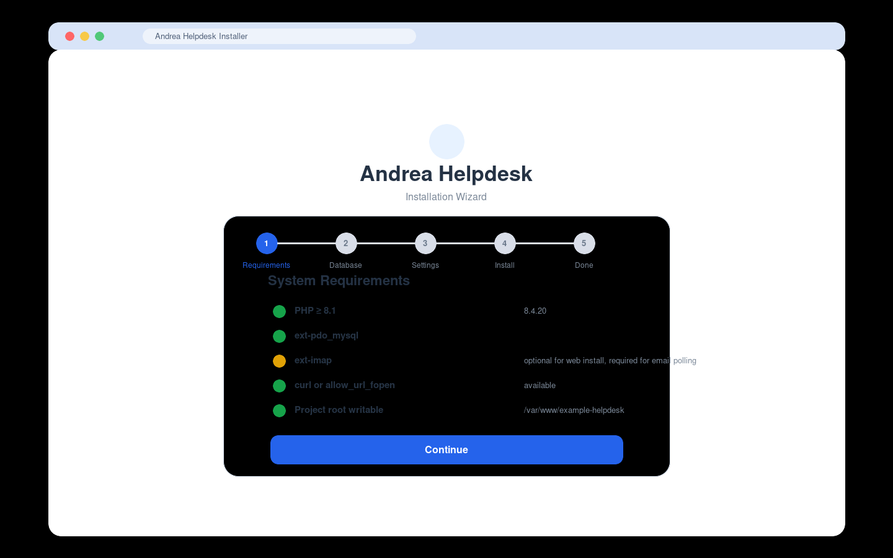
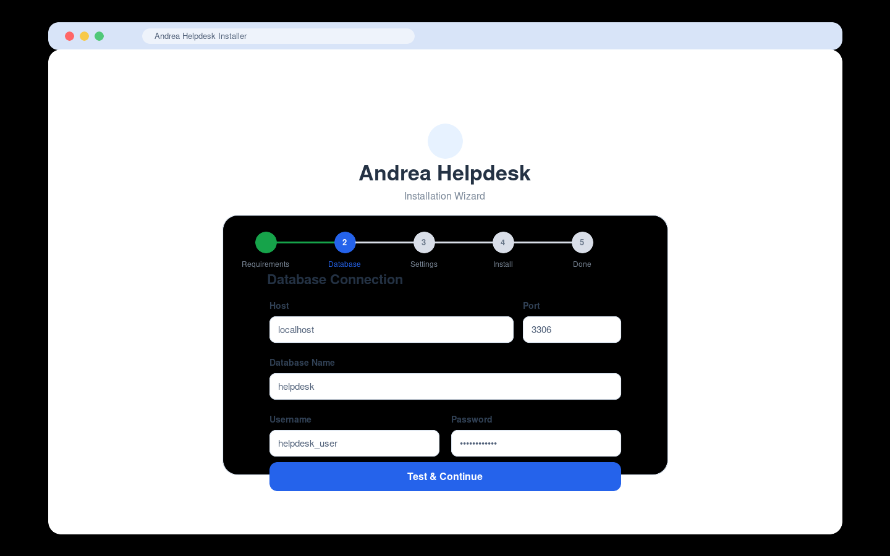
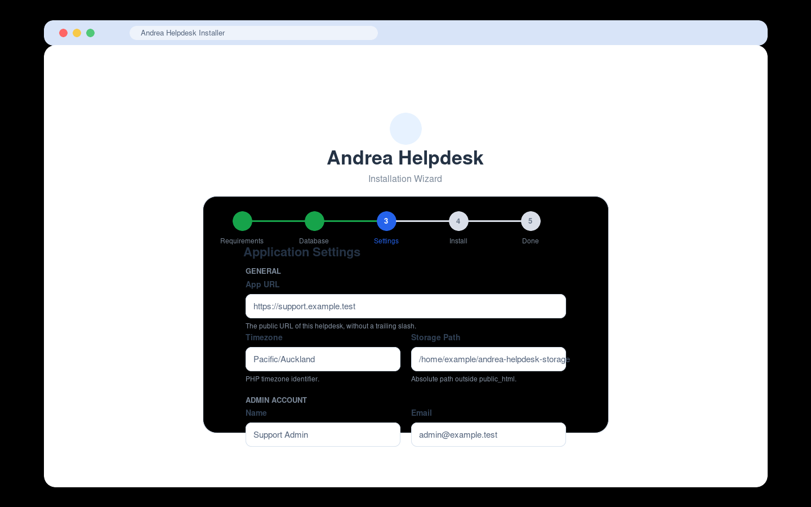
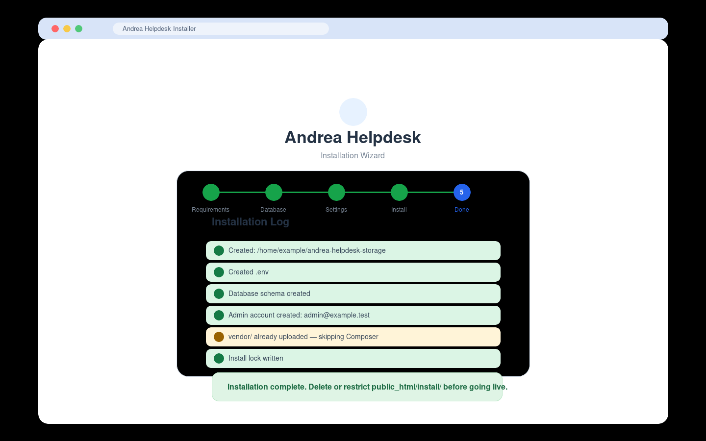

# Installation

This guide covers the three supported install paths for Andrea Helpdesk:

- command-line install on a VPS or dedicated server
- FTP / SFTP upload for shared hosting
- browser-based setup through `/install/`

If you just want the fastest path:

- use **Command Line Install** if you have SSH and Composer
- use **FTP + Web Installer** if you are on shared hosting

Bootstrap installer:

```bash
wget -qO - https://www.andreahelpdesk.com/installer/ | bash
```

The CLI installer will:

- check for `git`, `php`, `composer`, and `make`
- support either a local install or a remote SSH-driven deployment install
- write `.env`
- run migrations, seed the admin user, fetch assets, and install cron

---

## Requirements

Minimum server requirements:

- PHP 8.1 or newer
- MySQL 8.0 or newer
- Apache with `mod_rewrite` enabled, or equivalent web-server routing
- PHP extensions:
  - `pdo_mysql`
  - `mbstring`
  - `openssl`
- Recommended / optional:
  - `imap` for inbound email polling
  - `curl` or `allow_url_fopen` for installer asset downloads and update checks
  - cron access for IMAP polling and SLA checks

Directory layout requirements:

- `public_html/` must be the web document root
- `STORAGE_PATH` must be an absolute path outside `public_html/`
- the app must be able to write:
  - `.env`
  - the storage directory
  - `storage/logs`
  - `storage/attachments`

---

## Install Paths

### 1. Command Line Install

Use this when you have shell access and can run Composer on the server.

If you want the guided Bash installer, use:

```bash
wget -qO - https://www.andreahelpdesk.com/installer/ | bash
```

The installer will stop if the document root cannot point to `public_html/`. In that situation, use the FTP / SFTP flow instead.

#### Step 1: Place the application on the server

Example target path:

```bash
/var/www/andrea-helpdesk
```

If you are using Git:

```bash
git clone <your-repo-or-release-source> /var/www/andrea-helpdesk
cd /var/www/andrea-helpdesk
```

If you are uploading a release archive manually, extract it there and `cd` into the project root.

#### Step 2: Install PHP dependencies

```bash
composer install --no-dev --optimize-autoloader
```

#### Step 3: Create `.env`

```bash
cp .env.example .env
```

Edit `.env` and set at least:

- `APP_URL`
- `APP_TIMEZONE`
- `JWT_SECRET`
- `DB_HOST`
- `DB_PORT`
- `DB_DATABASE`
- `DB_USERNAME`
- `DB_PASSWORD`
- `STORAGE_PATH`
- `ADMIN_NAME`
- `ADMIN_EMAIL`
- `ADMIN_PASSWORD`

Important notes:

- `JWT_SECRET` should be a long random value, at least 32 characters
- `STORAGE_PATH` must be outside `public_html/`
- `ADMIN_PASSWORD` is used by `php bin/seed.php`; clear or rotate it afterward if that matters to your process

#### Step 4: Create the storage directories

Example:

```bash
mkdir -p /var/www/andrea-helpdesk-storage/attachments
mkdir -p /var/www/andrea-helpdesk-storage/logs
touch /var/www/andrea-helpdesk-storage/logs/app.log
touch /var/www/andrea-helpdesk-storage/logs/imap.log
```

#### Step 5: Run database setup

```bash
php bin/migrate.php
php bin/seed.php
```

`php bin/migrate.php` creates or updates the schema.

`php bin/seed.php` creates the initial admin agent using the `ADMIN_*` values from `.env`.

#### Step 6: Point the web root to `public_html/`

Your vhost or site config should serve:

```text
/var/www/andrea-helpdesk/public_html
```

not the project root.

#### Step 7: Log in

Open:

```text
https://your-domain.example/
```

and sign in with the admin email and password you set in `.env`.

#### Step 8: Add cron for IMAP polling and SLA checks

Recommended cron:

```cron
* * * * * php /var/www/andrea-helpdesk/bin/imap-poll.php >> /var/www/andrea-helpdesk-storage/logs/imap.log 2>&1
```

This handles:

- inbound email polling
- SLA escalation checks
- log trimming

---

### 2. FTP / SFTP Install

Use this when you do not have Composer or shell access on the hosting account.

#### Step 1: Prepare the upload locally

From your local checkout:

```bash
composer install --no-dev --optimize-autoloader
```

That ensures the `vendor/` directory is available before upload.

#### Step 2: Upload the project files

Upload the full project to your hosting account, including:

- `public_html/`
- `src/`
- `config/`
- `database/`
- `bin/`
- `vendor/`

The domain or subdomain should point at the uploaded `public_html/` directory.

Example layout:

```text
/home/example/support.example.com/
├── bin
├── config
├── database
├── public_html   ← document root
├── src
├── vendor
└── ../andrea-helpdesk-storage
```

#### Step 3: Create a storage directory outside the web root

Create a writable folder outside `public_html/`, for example:

```text
/home/example/andrea-helpdesk-storage
```

It should contain or allow creation of:

- `attachments/`
- `logs/`

If your host does not let PHP create folders automatically, create them manually.

#### Step 4: Run the browser installer

Open:

```text
https://your-domain.example/install/
```

Then complete the installer steps:

1. requirements check
2. database connection
3. application settings and admin account
4. install confirmation
5. completion log

The installer writes:

- `.env`
- database schema
- admin agent account
- `install.lock`

If the host blocks Composer or asset downloads, the installer will complete with warnings rather than failing hard. That is expected on some shared-hosting systems when you already uploaded `vendor/`.

#### Step 5: Restrict or remove the installer

After the install finishes:

- delete `public_html/install/`, or
- restrict it so it cannot be accessed publicly

The lock file prevents re-running, but removing or restricting the installer is still the right operational step.

---

### 3. Browser Installer Walkthrough

This section documents the `/install/` wizard itself.

#### Step 1: Requirements

The installer checks:

- PHP version
- required extensions
- download capability (`curl` or `allow_url_fopen`)
- schema file presence
- project-root writability
- vendor parent-directory writability
- whether `exec()` is available for Composer

Notes:

- `ext-imap` is shown as optional in the installer so the app can still be installed without email polling on day one
- `exec()` is also treated as optional because many shared hosts disable it

#### Step 2: Database Connection

Fields:

- `Host`
- `Port`
- `Database Name`
- `Username`
- `Password`

The installer tests the connection before allowing you to continue.

#### Step 3: Application Settings

General fields:

- `App URL`
- `Timezone`
- `Storage Path`

Admin account fields:

- `Name`
- `Email`
- `Password`
- `Confirm Password`

`Storage Path` must be an absolute server path outside `public_html/`.

#### Step 4: Ready To Install

The installer shows a summary of:

- app URL
- timezone
- storage path
- database target
- admin email

Click **Run Installation** to execute the install.

#### Step 5: Installation Log

The installer logs each step, including:

- directory creation
- `.env` creation
- schema creation
- admin creation
- frontend asset download
- Composer status
- lock file creation

If there are warnings but no errors, the install is usable, but you should still address those warnings before going live.

---

## Install Screenshots

These are mock screenshots based on the real installer flow. They are intentionally illustrative rather than literal captures.

### CLI Install



### FTP / Shared Hosting Layout



### Web Installer — Requirements



### Web Installer — Database



### Web Installer — Settings



### Web Installer — Complete



---

## Shared Hosting Notes

Some shared-hosting environments behave differently from VPS installs:

- `exec()` may be disabled
- Composer may not be available
- PHP may not be able to overwrite account-owned files during in-app updates
- cron may need to be configured from the hosting control panel instead of shell

That usually means:

- upload `vendor/` yourself
- use `/install/` for setup
- use manual FTP/SFTP deployment for upgrades if the in-app updater preflight reports overwrite or permission failures

Do not solve updater problems by making the app tree world-writable.

---

## Post-Install Checklist

After any install method:

1. Log in as the admin user.
2. Set branding, SMTP, and IMAP settings.
3. Confirm `APP_URL` is correct in **Admin → Settings → General**.
4. Configure cron for `bin/imap-poll.php`.
5. Send a test SMTP message.
6. Add an IMAP account and run **Poll Now**.
7. Remove or restrict `public_html/install/`.
