# Screenshots

A visual tour of Andrea Helpdesk. All screens are from the agent UI.

---

## Dashboard

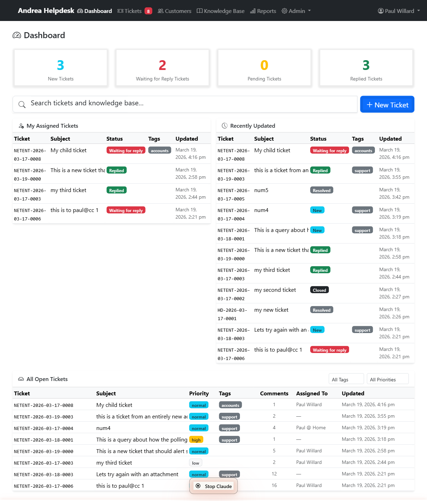

The dashboard is the first screen agents see after login. It shows four live counters at the top — **New Tickets**, **Waiting for Reply**, **Pending Tickets**, and **Replied Tickets** — giving an at-a-glance health check of the queue.

Below the counters, the dashboard is split into two ticket lists: **My Assigned Tickets** (tickets assigned to the current agent) and **Recently Updated** (across all agents). Each row shows the ticket number, subject, status badge, tags, and last-updated time. A search box at the top searches tickets and knowledge base articles simultaneously.

---

## Tickets

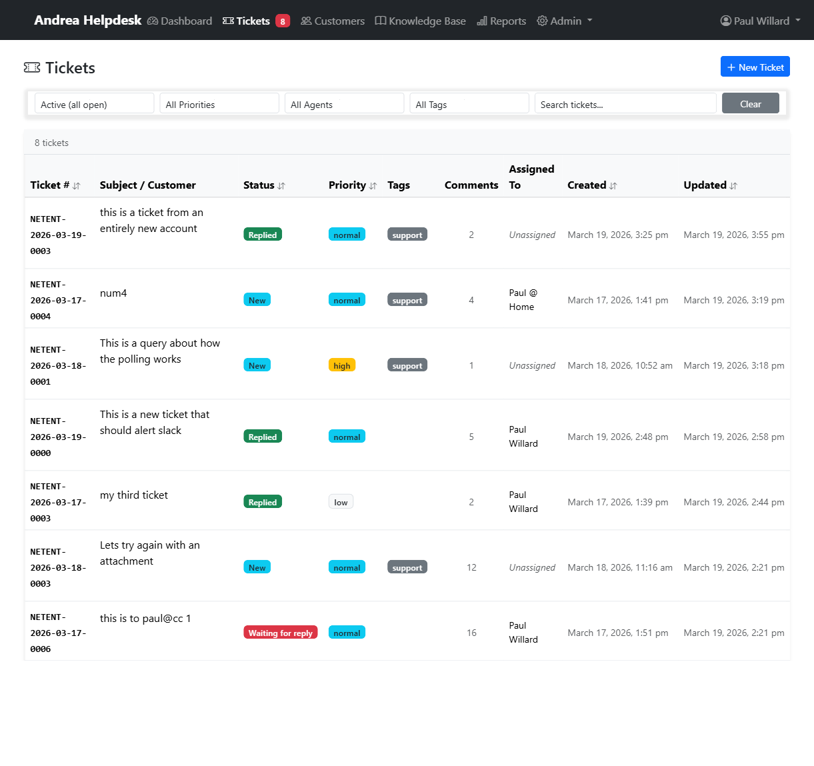

The main ticket list shows all tickets the agent has access to. Columns include ticket number, subject/customer name, status badge, priority badge, tags, comment count, assigned agent, and created/updated timestamps.

The filter bar at the top supports filtering by **status** (Active, New, Open, Waiting for Reply, Replied, Pending, Resolved, Closed), **priority**, **assigned agent**, and **tag**, as well as free-text search. The active ticket count is shown above the table. The navbar badge next to "Tickets" shows the count of active (non-resolved, non-closed) tickets at all times.

---

## Ticket Detail

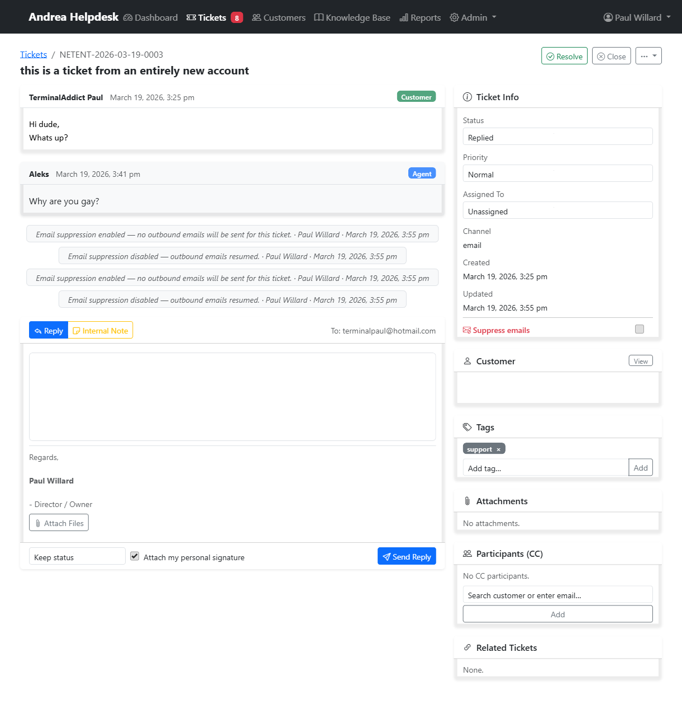

The ticket detail view shows the full conversation thread for a ticket. Each message displays the sender name, timestamp, and a **Customer** or **Agent** badge. Private internal notes are visually distinguished so they are never confused with customer-visible replies.

System events — such as the email suppression audit trail visible here — appear inline in the thread as grey italicised entries, recording who made the change and when.

The reply composer is **collapsed by default**. Clicking the **Reply** or **Internal Note** button auto-expands it; a chevron toggle button in the composer header collapses it again. The composer includes an attachment button, a signature toggle checkbox, and a "Keep status" selector. The **To:** address is shown in the header when collapsed so the recipient is always visible.

Customer names in reply/message headers are clickable links that navigate directly to the customer's profile page.

The **Ticket Info** sidebar on the right shows status, priority, assigned agent, channel, created/updated timestamps, and the **Suppress emails** toggle. When suppression is active, all outbound customer emails for this ticket are silenced — the toggle is recorded as a system event each time it changes. The sidebar also shows the linked customer, tags (with an inline add field), attachments, CC participants, and related/parent tickets.

---

## New Ticket

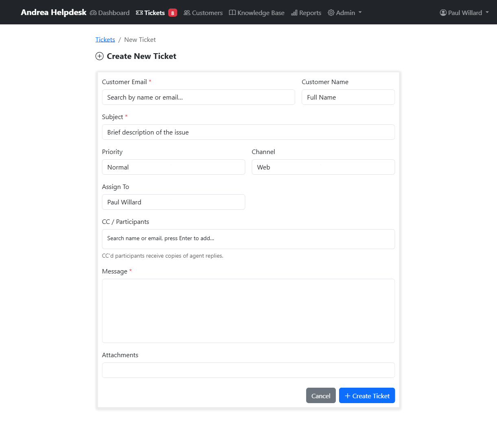

Agents can create tickets manually using the New Ticket form. The **Customer Email** field is a live search — typing searches existing customers by name or email and pre-fills the **Customer Name** field. If no match is found, a new customer record is created on submission.

Other fields include **Subject**, **Priority** (Normal by default), **Channel** (Web by default), **Assign To**, **CC / Participants** (free-text or search, press Enter to add each address), **Message**, and **Attachments**.

---

## Customers

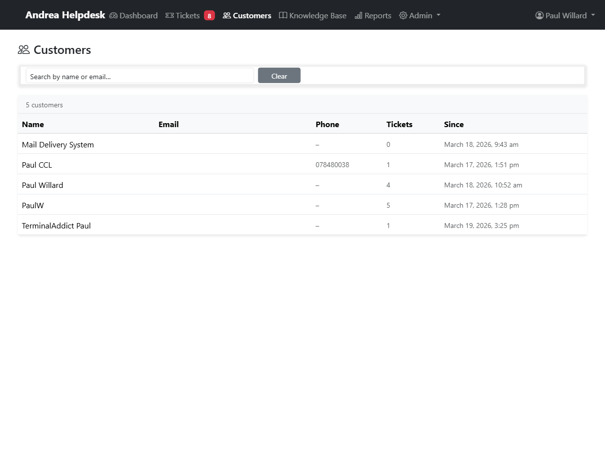

The customer list shows all customer records with their name, email, phone, total ticket count, and the date they were first seen. A live search box filters by name or email. Clicking any row opens the customer detail view.

Two action buttons sit in the top-right: **New Customer** opens a modal to create a single customer record; **Import CSV** opens the bulk import modal. The import modal includes a **Download Template CSV** button that downloads a pre-filled example file. After import, the modal reports how many customers were created and lists any skipped rows with their reason (duplicate email, invalid email, or missing required fields).

---

## Customer Detail

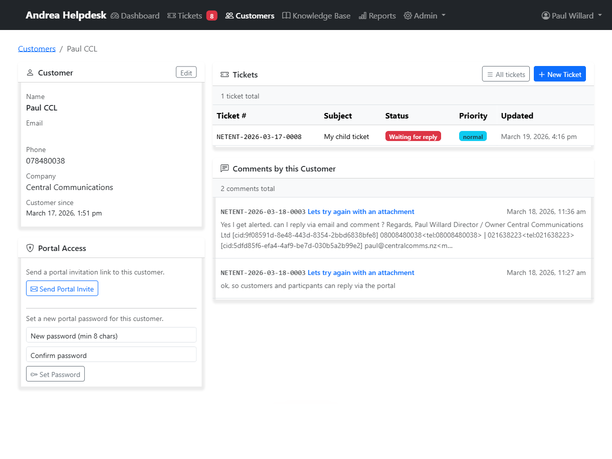

The customer detail view is split into two panels. The left panel shows the customer's name, email, phone, company, and the date they became a customer. Below that, a **Portal Access** section lets agents send a magic-link portal invitation email or manually set a portal password for the customer.

The right panel lists the customer's tickets (ticket number, subject, status, priority, last updated) and a chronological feed of all replies this customer has posted across every ticket — useful for understanding their history at a glance. A **+ New Ticket** button opens the new ticket form pre-filled with this customer.

---

## Reports

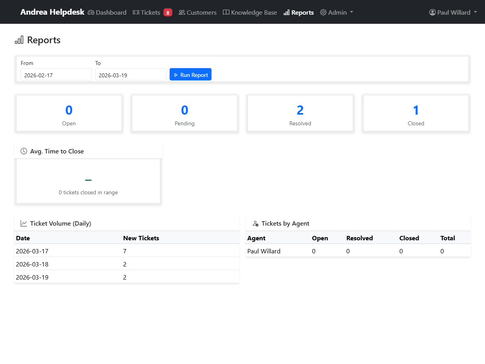

The reports screen provides a date-range report (From / To with a **Run Report** button). It returns four summary counters — **Open**, **Pending**, **Resolved**, and **Closed** — for the selected period, along with an **Avg. Time to Close** metric.

Below the summary, two tables break down activity further: **Ticket Volume (Daily)** shows new tickets created per day, and **Tickets by Agent** shows each agent's open, resolved, and closed counts for the period. Access to reports is controlled by the `view_reports` permission flag.

---

## Knowledge Base

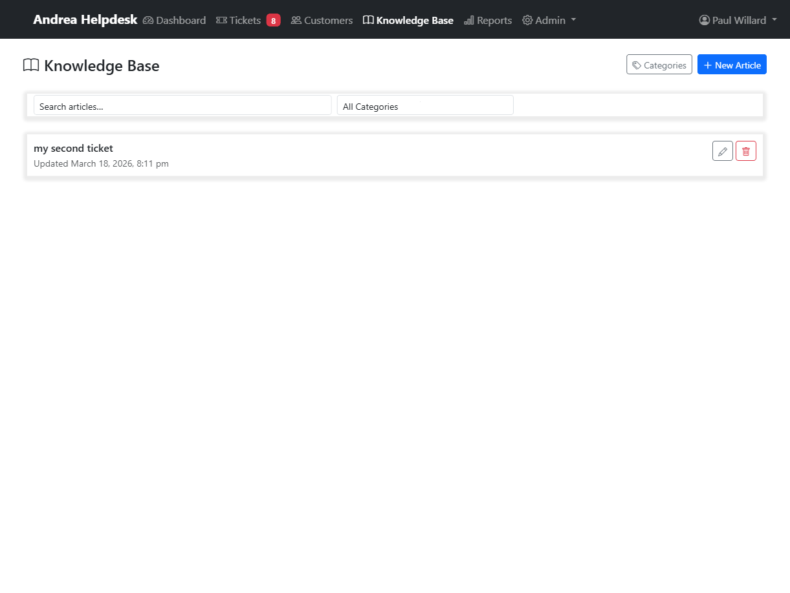

The knowledge base is an internal article library. Articles are searchable by title and filterable by category. Each article row shows its title, last-updated timestamp, and edit/delete action buttons.

A **Categories** button opens a modal for managing article categories. The **+ New Article** button opens the article editor. Access to managing the knowledge base is controlled by the `manage_kb` permission flag.

---

## Admin — Agents

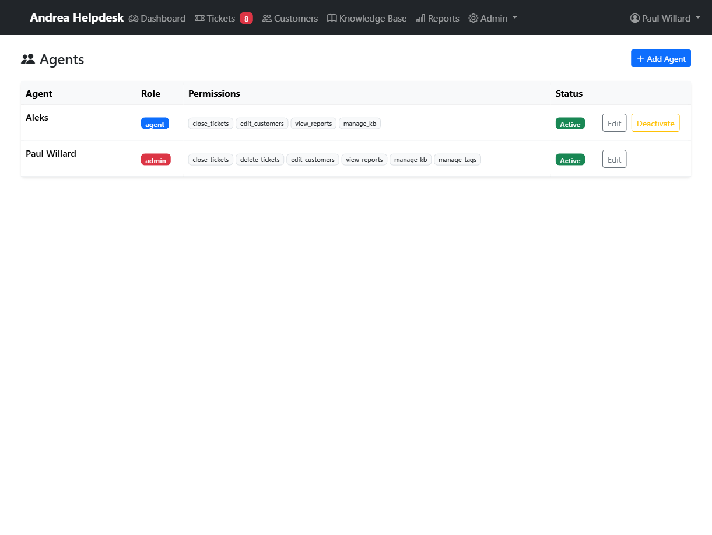

The agents admin screen lists all agent accounts with their role badge (**admin** in red, **agent** in blue), their currently granted permission tags, active/inactive status, and Edit / Deactivate action buttons. Admins can add new agents with the **+ Add Agent** button.

Permission tags visible per agent include: `close_tickets`, `delete_tickets`, `edit_customers`, `view_reports`, `manage_kb`, and `manage_tags`. Admin agents bypass all permission checks. Non-admin agents only have access to the actions corresponding to their granted permissions.

---

## Settings — General

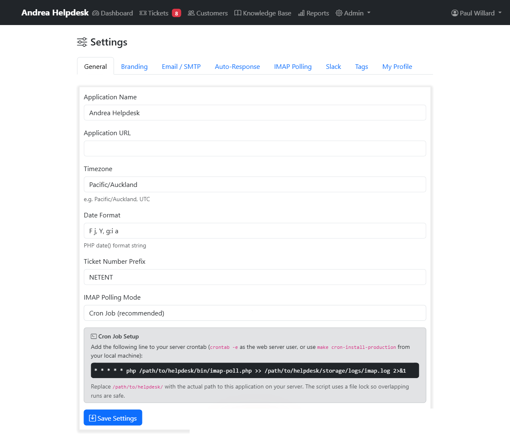

The General settings tab covers system-wide options: **Application Name**, **Application URL** (used in outbound email links), **Timezone**, **Date Format** (PHP `date()` format string), **Ticket Number Prefix**, and **IMAP Polling Mode**.

When IMAP Polling Mode is set to **Cron Job (recommended)**, a help box displays the exact crontab line to add, along with instructions for using `make cron-install-production` as a shortcut. The cron script uses a file lock so overlapping runs are safe.

---

## Settings — Branding

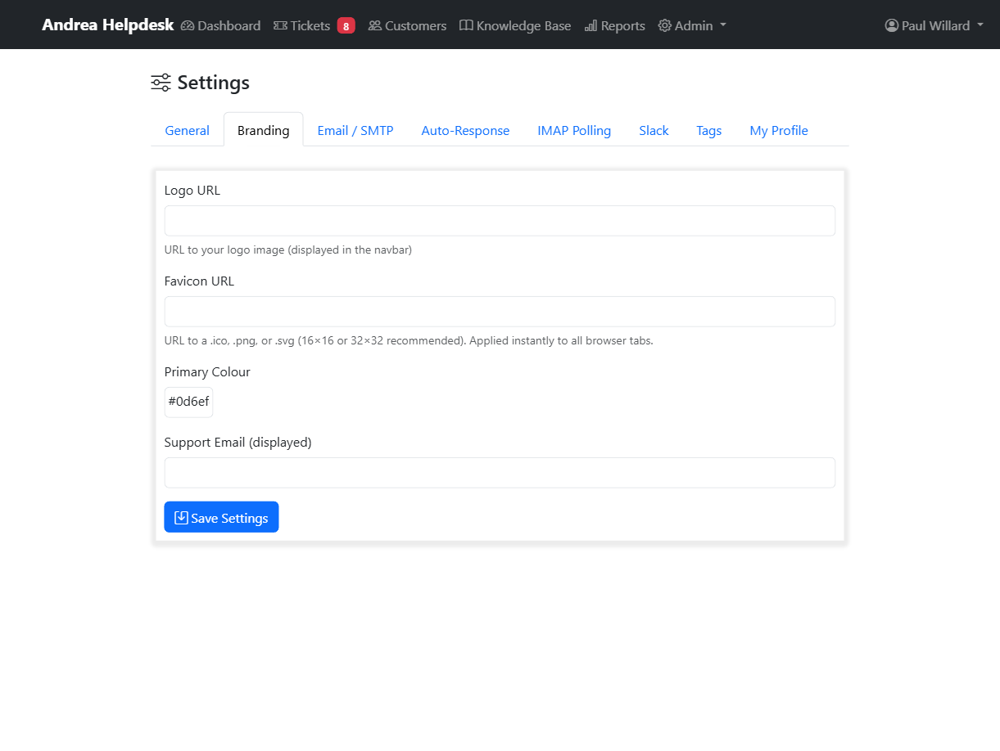

The Branding settings tab controls the visual identity of the helpdesk. **Logo URL** sets a custom logo displayed in the navbar. **Favicon URL** accepts `.ico`, `.png`, or `.svg` and is applied immediately to all browser tabs. **Primary Colour** is a hex value used for button and accent colours throughout the UI. **Support Email (displayed)** sets the contact address shown to customers in the portal and outbound emails.

---

## Settings — Email / SMTP

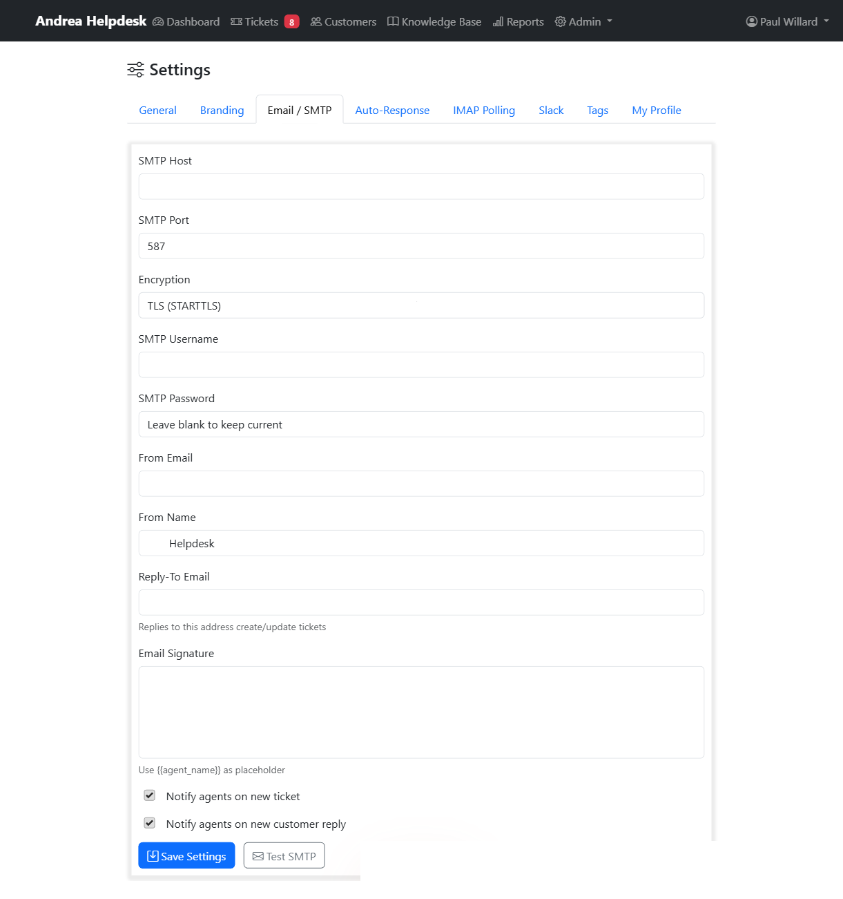

The Email / SMTP settings tab configures outbound mail. Fields include **SMTP Host**, **SMTP Port** (defaults to 587), **Encryption** (TLS/STARTTLS), **SMTP Username**, **SMTP Password** (leave blank to keep the current value — stored encrypted at rest), **From Email**, **From Name**, **Reply-To Email** (replies to this address create or update tickets), and **Email Signature** (supports the `{{agent_name}}` placeholder).

Two checkboxes control agent notification emails: **Notify agents on new ticket** and **Notify agents on new customer reply**. A **Test SMTP** button sends a test email using the saved configuration to verify delivery.

---

## Settings — Slack

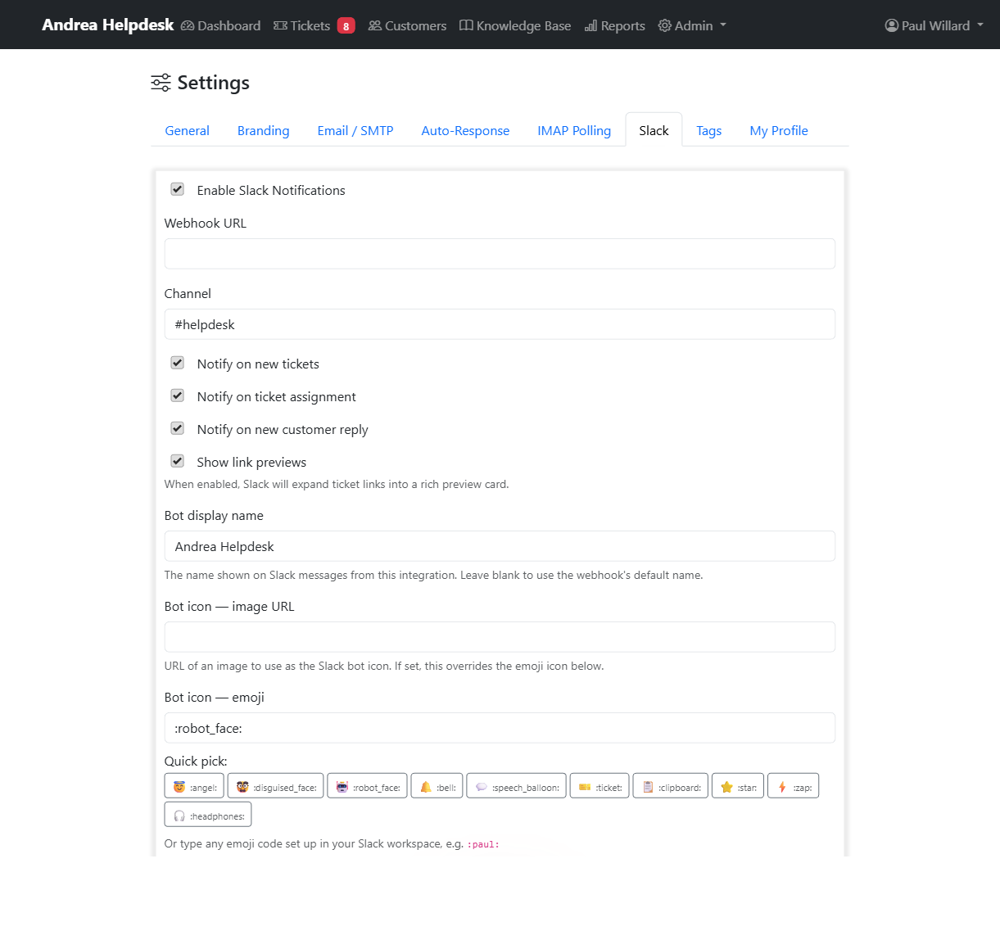

The Slack settings tab configures the incoming webhook integration. The **Webhook URL** field accepts a Slack incoming webhook URL. **Channel** sets the target channel (e.g. `#helpdesk`). Individual notification events can be toggled: **Notify on new tickets**, **Notify on ticket assignment**, **Notify on new customer reply**, and **Show link previews** (controls whether Slack unfurls ticket URLs into rich preview cards).

The **Bot display name** and **Bot icon** fields customise how messages appear in Slack — the icon can be set as an image URL or an emoji code, with a quick-pick emoji palette provided.

---

## Settings — Tags

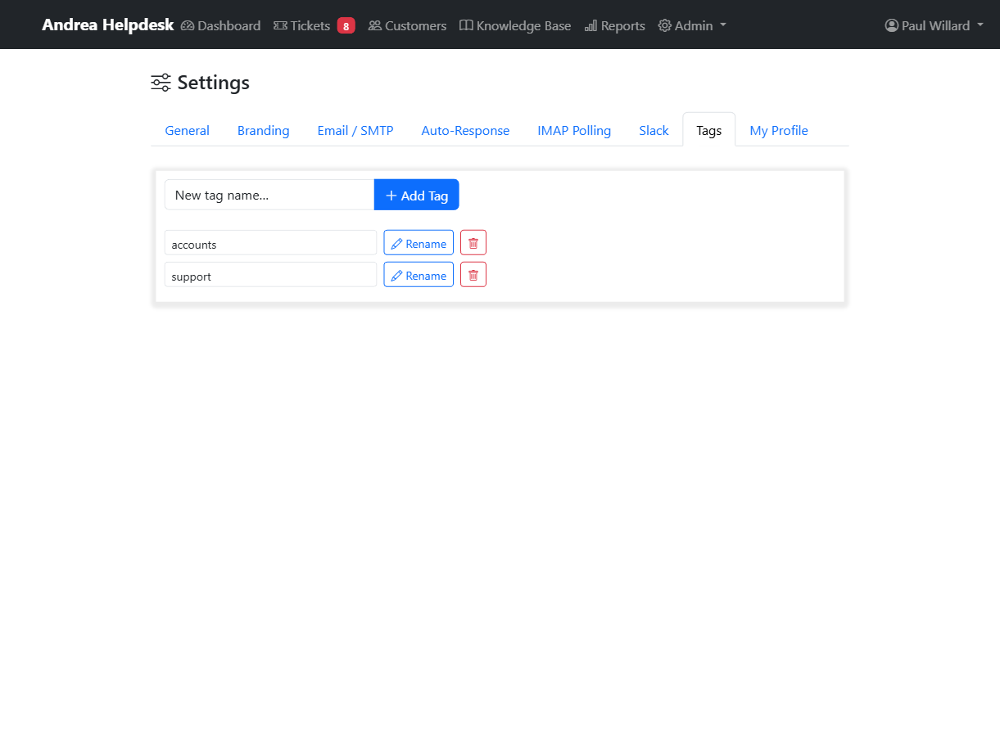

The Tags settings tab is where agents with the `manage_tags` permission manage the global tag list. Existing tags can be renamed inline or deleted. New tags are created by typing a name and clicking **+ Add Tag**. Tags created here appear in the ticket list filter and the tag selector on individual tickets.

---

## Settings — My Profile

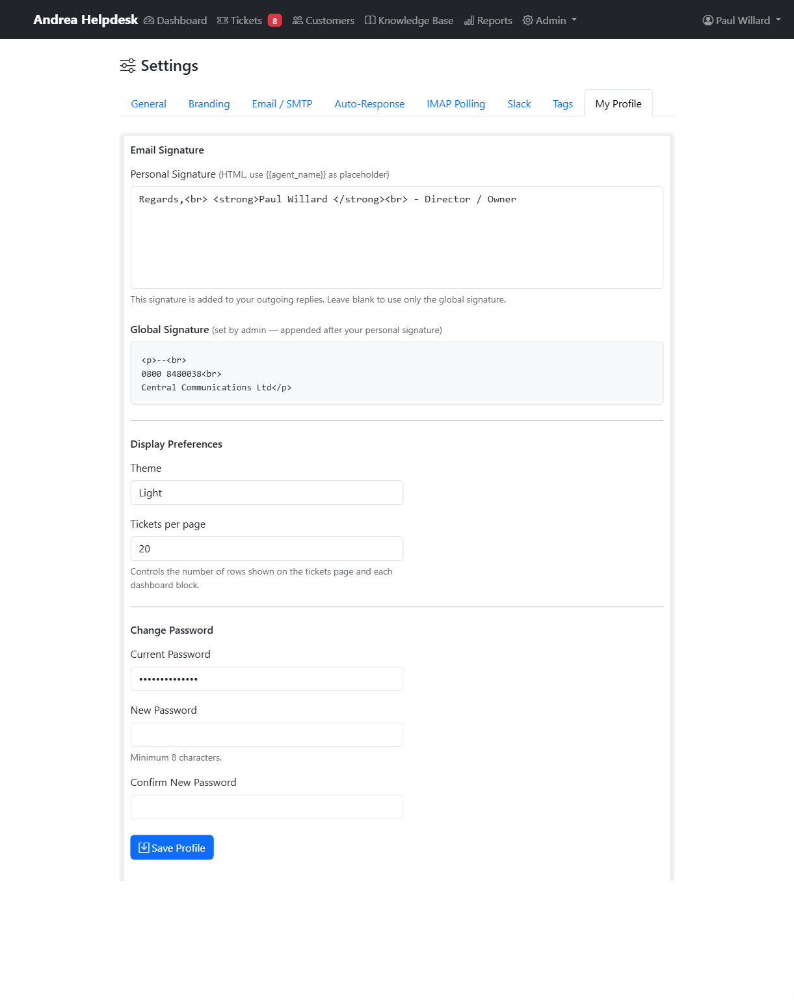

The My Profile tab is per-agent and controls personal preferences. **Email Signature** accepts HTML with `{{agent_name}}` as a placeholder — this is the agent's personal signature prepended to the global signature set by an admin. The read-only **Global Signature** preview shows what will be appended after the personal signature.

**Display Preferences** includes **Theme** (Light or Dark) and **Tickets per page** (controls row count in the ticket list and dashboard blocks). A **Change Password** section lets agents update their own login password.
