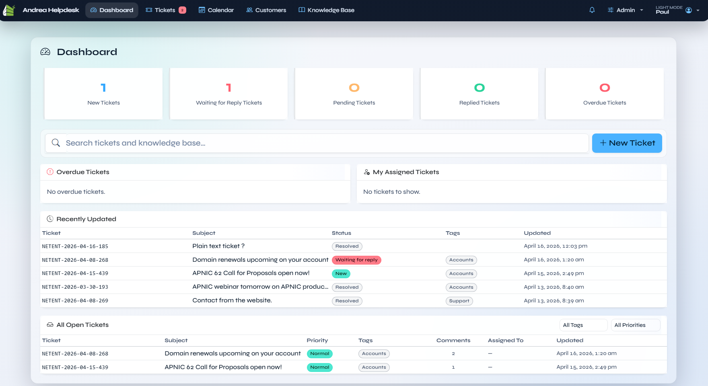
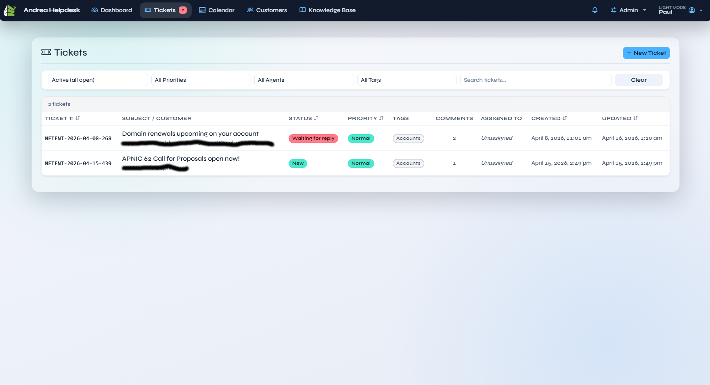
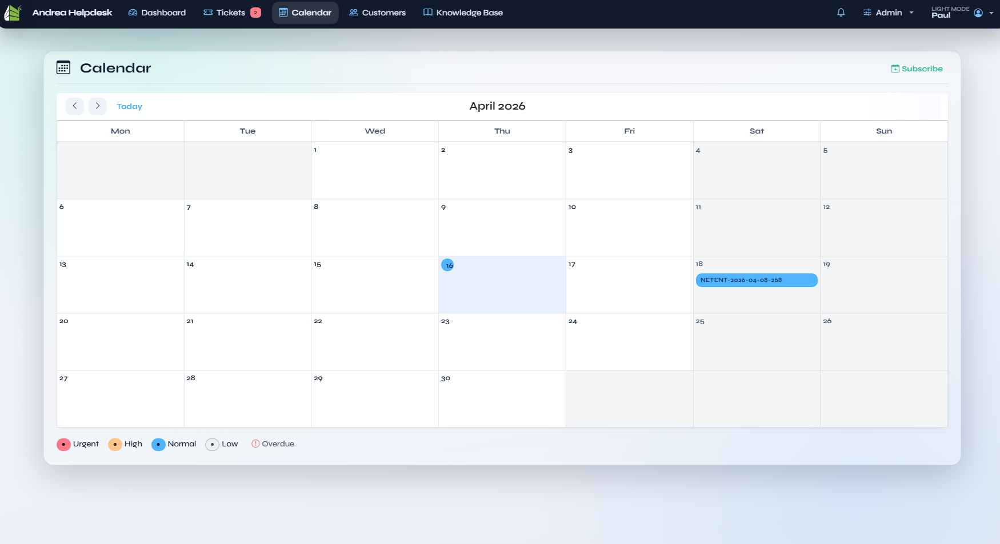
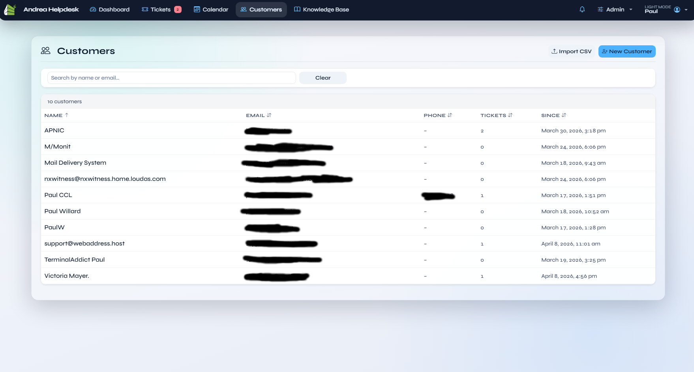
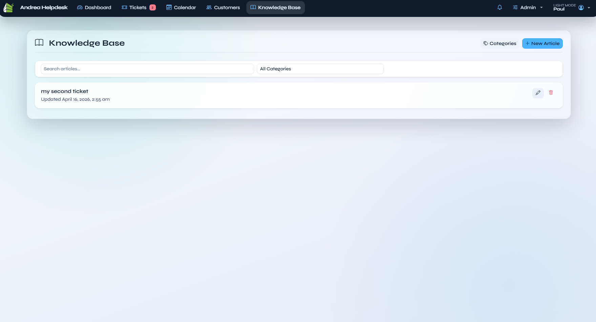

# Screenshots

This document maps the current screenshot set in [`docs/screenshots/`](screenshots) to the screens they represent.

The screenshot library now covers:
- agent login and agent workspace screens
- customer login and customer portal flows
- the expanded admin settings areas and modals
- Android PWA install and notification-permission prompts
- light and dark mode examples

Unless noted otherwise, screenshots are from the light theme.

---

## Login

### Agent Login

Filename: `agent login.png`

The shared login page with the **Agent Login** tab selected. It shows the Andrea Helpdesk brand panel, email/password fields, the **Remember me** toggle, and the split entry point between the staff helpdesk and the customer portal.

### Customer Login

Filename: `customer login.png`

The same shared login page with the **Customer Portal** tab selected, documenting the customer-facing entry route and the matching portal sign-in form.

---

## Dashboard And Core Agent Views

### Dashboard

Filename: `dashboard.png`

The main agent dashboard in light mode. It shows the live ticket counters, global search, and the ticket summary widgets that agents use for queue triage.

### Dashboard (Dark Mode)

Filename: `dashboard dark mode.png`

The dashboard in dark mode, included to document the alternate profile theme and the darker card/table treatment.

### Tickets

Filename: `tickets.png`

The main ticket list with filters, search, priority/status badges, tags, assignment, and pagination.

### Ticket Detail

Filename: `ticket details.png`

The ticket conversation view with the thread, ticket metadata, tags, participants, attachments, related records, and the ticket actions sidebar.

### Ticket Detail Reply / Internal Note

Filename: `ticket details reply or internal note.png`

The same ticket detail screen with the reply composer expanded, showing the reply/internal-note workflow, attachments area, and send controls.

### Calendar

Filename: `calendar.png`

The ticket calendar view, showing due-date scheduling on a month grid with colour-coded priority legends and the subscribe link for calendar feeds.

### Customers

Filename: `customers.png`

The customer list screen with search, customer metadata, and the table of all known customers.

### Customer Details

Filename: `customer details.png`

The customer profile screen, including the customer record fields, portal-access actions, ticket history, and the chronological reply/activity stream.

### Knowledge Base

Filename: `knowledgebase.png`

The knowledge base article list with search, category filtering, and article-management actions.

### Knowledge Base Detail

Filename: `knowledgebase detail.png`

An individual knowledge base article/editing screen, documenting the article body area and category/content workflow.

---

## Customer Portal

### Customer Portal Ticket List

Filename: `customer portal.png`

The customer portal home screen showing the customer's own tickets, status filtering, and the customer-side **New Ticket** entry point.

### Customer Portal New Ticket

Filename: `customer portal new ticket.png`

The customer-facing new-ticket form used to submit a support request directly from the portal.

### Customer Portal Reply

Filename: `customer portal reply.png`

The customer ticket detail / reply screen showing the portal conversation thread and customer reply workflow.

---

## Admin

### Admin Reports

Filename: `admin reports.png`

The reports screen with the current activity-based reporting layout, including date filters, summary cards, close-time metrics, and agent/activity tables.

### Admin Agents

Filename: `admin agents.png`

The agents administration list, showing roles, permissions, active/inactive status, last-login information, and the controls for editing, deactivating, or reactivating agents while preserving historical ownership and audit visibility.

### Admin Agents Edit Modal

Filename: `admin agents edit.png`

The add/edit agent modal, documenting the modal-based agent-management flow and the permission toggle layout.

### Admin Tags

Filename: `admin tags.png`

The dedicated tag-management screen used to maintain the global ticket tag list.

---

## Admin Settings

The settings screenshots now cover each route-backed admin settings section rather than the older tab-only documentation.

### General Settings

Filename: `admin settings.png`

The upper portion of **General** settings, including application identity, timezone/date settings, ticket prefix, and IMAP polling mode.

Filename: `admin settings 2.png`

The lower portion of **General** settings, showing cron setup help, SLA escalation controls, and the **Version & Updates** panel with the shared-hosting/file-ownership guidance.

### Branding Settings

Filename: `admin branding.png`

The **Branding** settings page for logo, favicon, primary colour, and support-email presentation.

The PWA uses the configured **Application Name** for the install manifest. It uses the optional **PWA / Notification Icon URL** from **Admin → Settings → Notifications** when set; otherwise it falls back to this Branding page's **Favicon URL**.

### Email / SMTP Settings

Filename: `admin email.png`

The upper section of **Email / SMTP** settings, covering transport settings such as host, port, encryption, credentials, from-addresses, and reply-to routing.

Filename: `admin email 2.png`

The lower section of **Email / SMTP** settings, showing the signature editor, notification toggles, save action, and the **Test SMTP** action.

### Auto-Response Settings

Filename: `admin auto reponse.png`

The **Auto-Response** settings page, documenting the automatic customer acknowledgement configuration.

### IMAP Polling Settings

Filename: `admin imap polling.png`

The IMAP account list and polling configuration screen used to manage inbound mailbox polling.

Filename: `admin imap pollling edit.png`

The IMAP add/edit modal for mailbox credentials, host, folder, and polling settings.

### Slack Settings

Filename: `admin slack.png`

The Slack integration settings page for webhook destination, posting behaviour, and Slack-side notification options.

### Support Form Settings

Filename: `admin settings support-form.png`

The **Support Form** settings page, showing the public support-form controls for reCAPTCHA v3 site and secret keys, the allowlist of website origins permitted to embed `/support-form/embed`, the direct public form URL, and the generated iframe embed snippet and preview.

---

## My Profile

### My Profile

Filename: `my profile.png`

The per-agent profile page, showing personal signature editing, global signature preview, display preferences, browser-notification controls, and the new profile-level navigation that includes the notifications overview.

---

## PWA And Mobile Install

### Android Chrome Install Menu

Filename: `Andrea Helpdesk install on Android.jpg`

Android Chrome showing Andrea Helpdesk with the browser install option available from the site menu.

### Android Install App Action

Filename: `Andrea Helpdesk - install app.jpg`

The Android Chrome **Install app** action for Andrea Helpdesk, documenting the user entry point for adding the PWA to the device.

### Android Install Confirmation

Filename: `Android prompt install Andrea Helpdesk.jpg`

The Android install confirmation prompt shown before Andrea Helpdesk is added to the device.

### Android Notification Permission

Filename: `Andrea Helpdesk wants to send you notifications - Android.jpg`

The Android browser / OS permission prompt shown after an agent enables browser push notifications for Andrea Helpdesk.

---

## Notes

- The older screenshot filenames such as `Dashboard.png`, `Tickets.png`, and `Settings_General.png` have been replaced by the current lower-case, space-separated set in `docs/screenshots/`.
- This document intentionally follows the actual on-disk filenames so it stays aligned with the current screenshot pack.
